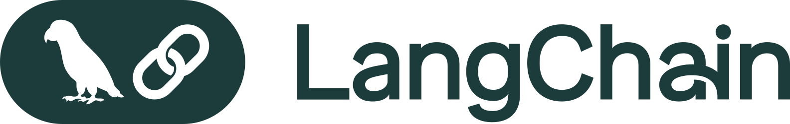

# AI-Native Full Stack App Builder

AI-developer-assisted workflow for building full-stack AI-native applications with local and cloud infrastructure. This repo is a template with detailed rules and workflows files for AI coding assistants.

## ⚡ Quickstart

**Prerequisites:**  
- [Cline](https://cline.bot/) installed in VS Code/Cursor (recommended AI coding assistant)
- Node.js 18+
- uv (Python package manager)
- Docker Desktop
- OpenAI or Anthropic API key
- LangSmith API key
- [Tavily API key](https://app.tavily.com/home) (free tier: 1,000 credits/month, no credit card required)

**Tavily MCP Server Setup:**

This template uses **two Tavily MCP servers** for web search capabilities:

1. **Tavily Expert** (hosted) - Pre-configured SSE server with documentation  
2. **github.com/tavily-ai/tavily-mcp** (local) - Direct API access

> **Tavily MCP Configuration**  
> [Tavily Expert MCP](https://tavily.tadata.com/docs)  
> [Tavily MCP](https://docs.tavily.com/documentation/mcp)

Get your AI-native application running in (tens of) minutes:

1. **Use this GitHub template** - Click "Use this template" button above
2. **Clone your new repo** - `git clone <your-repo-url>`
3. **Open in your IDE** - Open the project with Cline installed
4. **Run the workflow** - Type `/get-started.md` in Cline chat to begin the guided setup

> **📝 Important:** After cloning, run `cp .gitignore.template .gitignore` to properly track service folders. The template uses a different `.gitignore` during development.

Cline will execute each phase of the workflow and prompt you for input about your app. No need to read everything upfront - just start the workflow!

## 🎯 What Is This Template?

This template provides a complete multi-phase AI-developer workflow for building modern AI-native applications with:

- **Opinionated Stack:** LangChain/LangSmith + Supabase + Next.js + shadcn/ui
- **Workflow-Driven Development:** Step-by-step guides in `.clinerules` and `.clinefiles`
- **Production Patterns:** Best practices built-in from day one
- **AI-First Architecture:** Designed for agentic and generative capabilities
- **Comprehensive Documentation:** Detailed guides for every aspect

## 🤖 Built With

This template is designed to work seamlessly with modern AI coding assistants and leverages best-in-class technologies for rapid development.

### AI Development Assistant

<table>
<tr>
<td width="80" align="center">
<a href="https://cline.bot/" target="_blank">

</a>
</td>
<td>
<strong><a href="https://cline.bot/">Cline</a></strong> - The Collaborative Coding Agent<br/>
<em>Recommended backbone for AI-assisted development</em><br/>
<br/>
Open-source AI coding assistant with Plan/Act modes, complete transparency, and client-side architecture. Features 3.8M+ installs, SOC 2 compliance, and works with any AI model (Claude, GPT, Gemini, etc.). Perfect for workflow-driven development with this template's <code>.clinerules/</code> guides.
</td>
</tr>
</table>

### Core Technologies

<table>
<tr>
<td width="80" align="center">
<a href="https://www.langchain.com/langchain" target="_blank">

</a>
</td>
<td>
<strong><a href="https://www.langchain.com/langchain">LangChain</a></strong> - AI Agent Framework<br/>
Open-source framework with 1000+ integrations for building AI agents. Features proven agent patterns, model-agnostic design, middleware customization, and durable runtime with built-in persistence and memory.
</td>
</tr>
<tr>
<td width="80" align="center">
<a href="https://www.langchain.com/langsmith/deployment" target="_blank">

</a>
</td>
<td>
<strong><a href="https://www.langchain.com/langsmith/deployment">LangSmith Deployment</a></strong> - Agent Deployment Platform<br/>
Production deployment platform for LangChain agents. Features 1-click deployment, robust APIs for checkpointing and memory management, horizontal scaling, and built-in observability for enterprise workloads.
</td>
</tr>
<tr>
<td width="80" align="center">
<a href="https://supabase.com/" target="_blank">

</a>
</td>
<td>
<strong><a href="https://supabase.com/">Supabase</a></strong> - The Postgres Development Platform<br/>
Full Postgres database with built-in authentication, Row Level Security, Edge Functions, real-time subscriptions, file storage, and vector embeddings. "Build in a weekend, scale to millions."
</td>
</tr>
<tr>
<td width="80" align="center">
<a href="https://nextjs.org/" target="_blank">

</a>
</td>
<td>
<strong><a href="https://nextjs.org/">Next.js</a></strong> - The React Framework for the Web<br/>
React framework with built-in optimizations, Server Components, Server Actions, and advanced routing. Currently on Next.js 16 with App Router, TypeScript, and Tailwind CSS integration.
</td>
</tr>
<tr>
<td width="80" align="center">
<a href="https://vercel.com/" target="_blank">

</a>
</td>
<td>
<strong><a href="https://vercel.com/">Vercel</a></strong> - Frontend Cloud Platform<br/>
Cloud platform for deploying frontend applications with global CDN, automatic HTTPS, preview deployments, and AI capabilities. Created by the team behind Next.js for optimal framework integration and performance.
</td>
</tr>
</table>

### UI Libraries

<table>
<tr>
<td width="80" align="center">
<a href="https://ui.shadcn.com/" target="_blank">

</a>
</td>
<td>
<strong><a href="https://ui.shadcn.com/">shadcn/ui</a></strong> - Beautifully Designed Components<br/>
Not a component library - components you copy into your apps and own. Built on Radix UI primitives. Accessible, customizable, and open source. Includes 50+ production-ready components that you can modify to fit your needs.
</td>
</tr>
<tr>
<td width="80" align="center">
<a href="https://supabase.com/ui" target="_blank">

</a>
</td>
<td>
<strong><a href="https://supabase.com/ui">Supabase UI</a></strong> - Pre-Built UI Components<br/>
Official Supabase component library with pre-built authentication forms, data tables, and dashboard layouts. Designed specifically for Supabase integration with built-in support for auth flows, real-time updates, and database operations.
</td>
</tr>
<tr>
<td width="80" align="center">
<a href="https://reactflow.dev/" target="_blank">

</a>
</td>
<td>
<strong><a href="https://reactflow.dev/">React Flow</a></strong> - Node-Based UI Library<br/>
Powerful library for building node-based editors, workflow designers, diagrams, and interactive visualizations. Features drag-and-drop, zooming, panning, custom nodes, and extensive customization options. Perfect for AI workflow builders.
</td>
</tr>
</table>

### AI Agent Services

<table>
<tr>
<td width="80" align="center">
<a href="https://tavily.com/" target="_blank">

</a>
</td>
<td>
<strong><a href="https://tavily.com/">Tavily</a></strong> - AI-Optimized Search Engine<br/>
Search engine built for LLMs and AI agents, providing real-time web information. Features intelligent search, content extraction, website crawling, and site mapping capabilities. Free tier includes 1,000 API credits monthly. Integrated via two MCP servers (hosted + local).
</td>
</tr>
</table>

### Why These Technologies?

- **Cline**: Workflow-driven development with Plan/Act modes aligns perfectly with the template's `.clinerules/` guides
- **LangChain**: Battle-tested agent framework with extensive model integrations
- **Tavily**: Real-time web search and data extraction optimized for AI agents
- **LangSmith**: Production-ready deployment with enterprise features included
- **Supabase**: Complete backend-as-a-service eliminates infrastructure complexity
- **Next.js**: Industry-standard React framework with excellent DX and built-in optimizations
- **Vercel**: Zero-config deployments with global performance out of the box
- **shadcn/ui**: Copy-paste components you own and customize, not a dependency
- **Supabase UI**: Official component library designed specifically for Supabase workflows
- **React Flow**: Best-in-class solution for node-based UIs and workflow visualization

### 🏠 Local-First Development

**A key advantage of this stack:** Every technology in this template provides a complete local development environment that emulates the cloud service, enabling full-stack development entirely on your machine:

- **LangSmith Deployment** → `langgraph dev` runs a local server with LangGraph Studio for testing agents
- **Supabase** → `supabase start` runs a local Supabase with full PostgreSQL, Auth, Realtime, Storage, an UI
- **Next.js** → Built-in dev server with hot reload and instant updates
- **Vercel** → Local preview mode for testing deployments before pushing

This means you can build and test your entire application - database, authentication, AI agents, and frontend - completely offline, with zero cloud dependencies during development. Deploy to production only when ready.

## 🌟 What Makes This Template Special

### Smart Documentation Architecture

This template uses a unique two-tier documentation system:

- **`.clinerules/`** - Active workflow guides and rules that Cline reads automatically
- **`.clinefiles/`** - Passive reference documentation (patterns, examples, detailed guides)

**Why this matters:** Only active rules fill the context window, while detailed documentation is accessed on-demand. This means Cline starts with clear, actionable workflows without context bloat, while still having comprehensive patterns and examples available when needed.

### Production-Ready LangChain Architecture

Our `.clinefiles/` includes battle-tested patterns built on real production experience:

- **Middleware-centric agent design** - Composable, reusable agent components instead of monolithic code
- **Separation of concerns** - Core identity vs tool guidance (core_prompt.py vs tools_prompt.py)
- **{tools_list} placeholder pattern** - Dynamic tool injection without regenerating entire prompts
- **Reference implementations** - Working Python code for GuardrailsMiddleware, ToolsMiddleware, SpecialistAgentsMiddleware, and more

These aren't theoretical examples - they're patterns that have been refined through real-world agent deployments.

## 🏗️ Template Structure

```
template-repo/
├── .clinerules/              # Active rules (loaded in context)
│   ├── workflows/           # Step-by-step development workflows
│   └── guide-index.md      # Master catalog of all guides
├── .clinefiles/             # Passive reference docs (accessed on-demand)
│   ├── langchain/          # LangChain patterns and implementations
│   │   ├── core/          # Core concepts (agents, memory, tools)
│   │   ├── patterns/      # Production patterns (middleware-centric)
│   │   ├── langsmith/     # Deployment guides
│   │   └── reference-implementations/  # Working Python code
│   ├── supabase/          # Supabase patterns and guides
│   │   └── database/      # Migrations, RLS, functions
│   └── ui/                # UI patterns and component guides
├── .gitignore.template     # User .gitignore (tracks service folders)
├── .gitignore             # Template dev .gitignore (ignores service folders)
├── .env.example            # Template environment variables
└── README.md              # This file

# Created by workflows (not in template):
├── nextjs_/                 # Next.js application service
├── supabase_/              # Supabase database service
├── langchain_/             # LangChain AI service (Phase 8)
└── project/                # AI assistant progress tracking
    ├── services/          # Service-specific docs
    ├── decisions/         # Architecture decisions
    └── WORKFLOW_CHECKPOINT.md
```

## 📚 Core Services

### nextjs_/
Frontend application built with:
- Next.js 16 with App Router
- TypeScript (strict mode)
- Tailwind CSS v3
- shadcn/ui components
- Supabase Auth & Realtime

### supabase_/
Backend services including:
- PostgreSQL database
- Row Level Security (RLS)
- Authentication system
- Real-time subscriptions
- File storage (optional)

### langchain_/
AI agent service featuring:
- LangChain/LangGraph framework
- Middleware-centric architecture
- LangSmith deployment platform
- Automatic memory management
- Production patterns

## 📖 Using the Workflows

This template includes two main workflows that you can invoke with Cline's slash command feature. Simply type `/workflow-name.md` in Cline chat to start:

### Get-Started Workflow
**Purpose:** Building a new AI-native application from scratch  
**Command:** Type `/get-started.md` in Cline chat

**Phases:**
1. **Discovery** - Define your application requirements
2. **Supabase Setup** - Database, auth, and RLS
3. **Next.js Setup** - Frontend application
4. **Marketing & UI** - Landing page and dashboard
5. **CRUD Implementation** - Full data operations
6. **User Management** - Profiles and settings
7. **Advanced Features** - ReactFlow, realtime, etc.
8. **Polish & Docs** - Production-ready polish
9. **AI Service** - LangChain agent integration
10. **System Review** - Final validation

**Start here:** `.clinerules/workflows/get-started.md`

### New-Feature Workflow
**Purpose:** Adding features to existing applications  
**Command:** Type `/new-feature.md` in Cline chat

**Phases:**
1. **Feature Discovery** - Planning and requirements
2. **Database Updates** - Schema changes (if needed)
3. **Frontend Implementation** - UI components (if needed)
4. **Agent Integration** - AI capabilities (if needed)
5. **Integration Testing** - End-to-end validation
6. **Documentation** - Update docs (always required)

**Start here:** `.clinerules/workflows/new-feature.md`

## 🤖 Working with AI Coding Assistants

This template is optimized for AI-powered development with Cline:

### Starting Your Workflow
Simply type `/get-started.md` or `/new-feature.md` in Cline chat to begin. The workflow system:
- Loads active rules from `.clinerules/` automatically
- References detailed guides from `.clinefiles/` only when needed
- Keeps context efficient while maintaining comprehensive documentation access

### Plan Mode vs Act Mode
- **Plan Mode:** Gather information, discuss approach, create detailed plans
- **Act Mode:** Execute changes, write code, modify files

### How It Works
1. **Invoke workflow** - Type `/get-started.md` in Cline chat
2. **Plan Mode** - Cline reads workflow and plans approach
3. **Toggle to Act Mode** - Switch when ready to implement
4. **Execution** - Cline follows step-by-step instructions
5. **Iteration** - Return to Plan Mode between phases

### Progress Tracking
The AI assistant creates a `project/` folder during development to track:
- **WORKFLOW_CHECKPOINT.md** - Overall progress through phases
- **project/services/** - Service-specific implementation notes
- **project/decisions/** - Architecture decision records

This folder is created during development and specific to your project, not part of the template.

## 🎨 Key Features

### Built-In Best Practices
- ✅ TypeScript strict mode throughout
- ✅ Comprehensive error handling
- ✅ Loading states on all async operations
- ✅ Toast notifications for user feedback
- ✅ Row Level Security on all tables
- ✅ Middleware-centric agent architecture

### Production-Ready Patterns
- ✅ Environment variable management
- ✅ Authentication with SSR support
- ✅ Database migrations and seeding
- ✅ Real-time subscriptions
- ✅ AI agent streaming responses
- ✅ Comprehensive documentation

### Developer Experience
- ✅ Hot reload in development
- ✅ Local Supabase with Docker
- ✅ LangGraph Studio for agent testing
- ✅ shadcn/ui component library
- ✅ Detailed troubleshooting guides

## 📚 Documentation Structure

### Active Rules (.clinerules/)
**Workflow guides loaded automatically in Cline's context:**
- `.clinerules/workflows/` - Step-by-step development workflows
- `.clinerules/guide-index.md` - Master catalog linking to all guides

These files define the high-level workflow structure and tell Cline which detailed guides to read from `.clinefiles/`.

### Passive Reference Docs (.clinefiles/)
**Detailed guides accessed on-demand:**
- `.clinefiles/langchain/` - Complete LangChain patterns and reference implementations
- `.clinefiles/supabase/` - Supabase-specific patterns and best practices
- `.clinefiles/ui/` - UI component guides and patterns

These comprehensive guides are only loaded into context when needed, keeping your workflow efficient.

### Project Documentation (project/)
**Created by AI assistant during development:**
- The workflow creates this folder to track your specific progress
- Documents your implementation decisions
- Records architecture choices and service-specific notes
- Not part of the template - unique to each project

## 🔧 Environment Configuration

This project uses **service-specific .env files** following framework conventions:

### Setup Steps

1. **Copy the template:**
   ```bash
   # For Next.js
   cp .env.example nextjs_/.env.local
   
   # For LangChain (created in Phase 8)
   cp .env.example langchain_/.env
   ```

2. **Get Supabase credentials:**
   ```bash
   cd supabase_
   supabase start
   # Copy the printed credentials (URL and ANON_KEY) to your .env files
   ```

3. **Add your API keys** to each service's .env file

### Required Variables by Service

**Next.js (`nextjs_/.env.local`):**
- `NEXT_PUBLIC_SUPABASE_URL` - From `supabase start` output
- `NEXT_PUBLIC_SUPABASE_ANON_KEY` - From `supabase start` output
- `NEXT_PUBLIC_AGENT_API_URL` - LangChain service URL (if using agents)

**LangChain (`langchain_/.env`):**
- `OPENAI_API_KEY` or `ANTHROPIC_API_KEY` - LLM provider key
- `LANGSMITH_API_KEY` - For LangSmith deployment
- `SUPABASE_URL` - From `supabase start` output (if agent needs DB access)
- `SUPABASE_KEY` - From `supabase start` output (if agent needs DB access)

**Supabase (`supabase_/`):**
- No .env needed - uses `config.toml` for configuration

### Why Separate Files?

Each service has its own .env file because:
- ✅ Follows framework conventions (Next.js expects `.env.local` in its root)
- ✅ Service isolation and portability
- ✅ Works with deployment platforms (Vercel, LangSmith)
- ✅ Better IDE/tooling support

The `.env.example` at the project root serves as documentation, while actual `.env` files in each service provide runtime configuration.

## 🔍 Tavily MCP Servers

This template includes **two Tavily MCP servers** for AI-powered web search capabilities:

### 1. Tavily Expert (SSE Server)
**Pre-configured hosted server with documentation tools**

- **Type:** Server-Sent Events (SSE)
- **Provides:** Search, extract, crawl, map + built-in documentation and best practices
- **Use for:** Learning Tavily, getting integration guidance, checking API patterns
- **Setup:** [Tavily Expert MCP Documentation](https://tavily.tadata.com/docs)

### 2. github.com/tavily-ai/tavily-mcp (Local Installation)
**Locally installed server with direct API access**

- **Type:** stdio (Node.js process)
- **Provides:** Direct access to core Tavily tools
- **Use for:** Production implementations, guaranteed availability

### Setup Instructions

**1. Get your Tavily API Key:**
- Visit [app.tavily.com/home](https://app.tavily.com/home)
- Sign up for free (no credit card required)
- Free tier includes 1,000 API credits monthly

**2. Configure MCP Servers:**

**Tavily Expert (SSE Server):**
- Follow the [Tavily Expert MCP setup guide](https://tavily.tadata.com/docs) for SSE server configuration

**github.com/tavily-ai/tavily-mcp (Local Server):**
- Follow the [official Tavily MCP installation guide](https://docs.tavily.com/documentation/mcp) for local installation
- The guide covers: Remote MCP setup, local installation, configuration for different clients, and troubleshooting

**3. Available Capabilities:**
- **Search** - Real-time web search with filters and domain control
- **Extract** - Content extraction from specific URLs
- **Crawl** - Systematic website exploration
- **Map** - Website structure discovery

**4. LangChain Integration:**

When building agents in Phase 8, use the official `langchain-tavily` package:

```bash
cd langchain_
uv add langchain-tavily
```

See `.clinefiles/tavily/capabilities-and-integration.md` for complete integration patterns and examples.

## 🎯 Development Workflow

### Starting Development

**Important:** Each service command must be run from inside its respective folder (`supabase_/`, `nextjs_/`, `langchain_/`).

1. **Start Supabase:**
   ```bash
   cd supabase_
   supabase start
   ```

2. **Start Next.js:**
   ```bash
   cd nextjs_
   npm install
   npm run dev
   ```

3. **Start AI Service (Phase 8+):**
   ```bash
   cd langchain_
   langgraph dev
   ```

### Common Commands

**Supabase:**
```bash
cd supabase_           # Navigate to supabase folder FIRST
supabase start         # Start local instance
supabase stop          # Stop local instance
supabase db reset      # Reset and rerun migrations
supabase db diff       # Generate migration from changes
```

**Next.js:**
```bash
npm run dev            # Development server
npm run build          # Production build
npm run lint           # Run linter
```

**LangChain:**
```bash
uv add <package>       # Add Python package (NOT pip!)
langgraph dev          # Start dev server with Studio
langgraph push         # Deploy to LangSmith
```

## 📖 Learning Resources

### Essential Reading
Before starting, familiarize yourself with:
1. `.clinerules/workflows/get-started.md` - Main workflow anchor
2. `.clinerules/guide-index.md` - Complete guide catalog

### Key Guides by Topic

**Authentication:**
- `.clinerules/supabase/auth-for-nextjs.md` - **CRITICAL** SSR patterns

**Database:**
- `.clinerules/supabase/database/create_migrations.md` - Migration patterns
- `.clinerules/supabase/database/create_rls_policies.md` - Security policies

**AI Agents:**
- `.clinerules/langchain/patterns/middleware-centric.md` - **CRITICAL** agent architecture
- `.clinerules/langchain/core/short-term-memory.md` - Thread memory
- `.clinerules/langchain/core/long-term-memory.md` - Persistent storage

**UI Components:**
- `.clinerules/ui/shadcn-components.md` - Component catalog
- `.clinerules/ui/shadcn-blocks.md` - Pre-built patterns

## 🚢 Deployment

> **⚠️ COMING SOON:** Comprehensive deployment guides and CI/CD pipelines are currently in development. Manual deployment is supported via the platforms below.

### Next.js Frontend
**Recommended:** Vercel
```bash
# Connect repo to Vercel
vercel

# Set environment variables in Vercel dashboard
# Deploy
vercel --prod
```

### Supabase Database
**Recommended:** Supabase Cloud
```bash
# Create project in Supabase dashboard
# Link local to cloud
supabase link --project-ref <your-ref>

# Push migrations
supabase db push
```

### LangChain Service
**Recommended:** LangSmith Platform
```bash
# Push to LangSmith
langgraph push

# Configure in LangSmith dashboard
# Monitor in production
```

### CI/CD Automation
> **⚠️ COMING SOON:** Automated deployment pipelines, testing workflows, and infrastructure-as-code configurations.

## 🐛 Troubleshooting

### Common Issues

**"Supabase won't start"**
- Ensure Docker Desktop is running
- Check ports 54321-54325 are not in use
- Try `supabase stop` then `supabase start`

**"Next.js auth not working"**
- Verify `NEXT_PUBLIC_SUPABASE_ANON_KEY` (not PUBLISHABLE_KEY)
- Check Supabase client files use getAll/setAll cookies
- Review `.clinerules/supabase/auth-for-nextjs.md`

**"Agent memory not persisting"**
- Confirm using `thread_id` parameter
- Verify NOT manually instantiating PostgresSaver
- Check `.clinerules/langchain/core/short-term-memory.md`

**"Python dependencies failing"**
- Always use `uv add`, never `pip install`
- Check Python version is 3.11+
- Review `.clinerules/langchain/langsmith/local-development.md`

### Getting Help

1. **Check relevant guide in `.clinerules/`**
2. **Review phase-specific troubleshooting**
3. **Search workflow checkpoint for similar issues**
4. **Consult official documentation:**
   - Next.js: https://nextjs.org/docs
   - Supabase: https://supabase.com/docs
   - LangChain: https://python.langchain.com/
